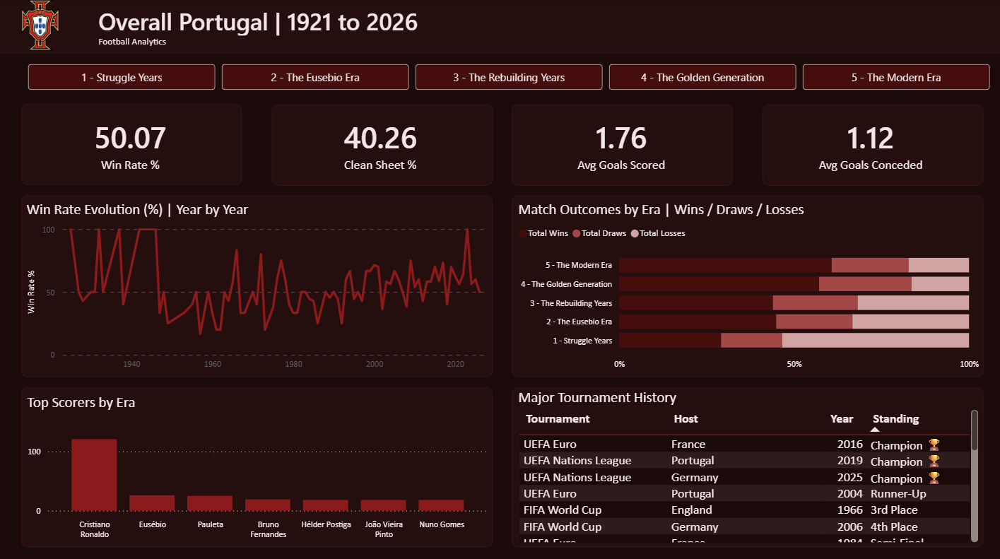
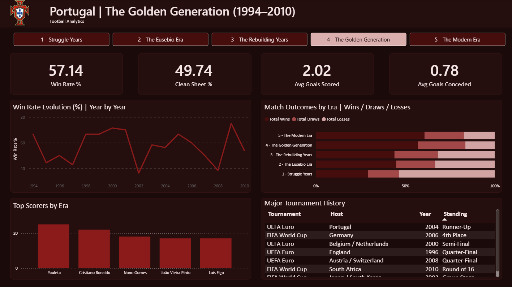
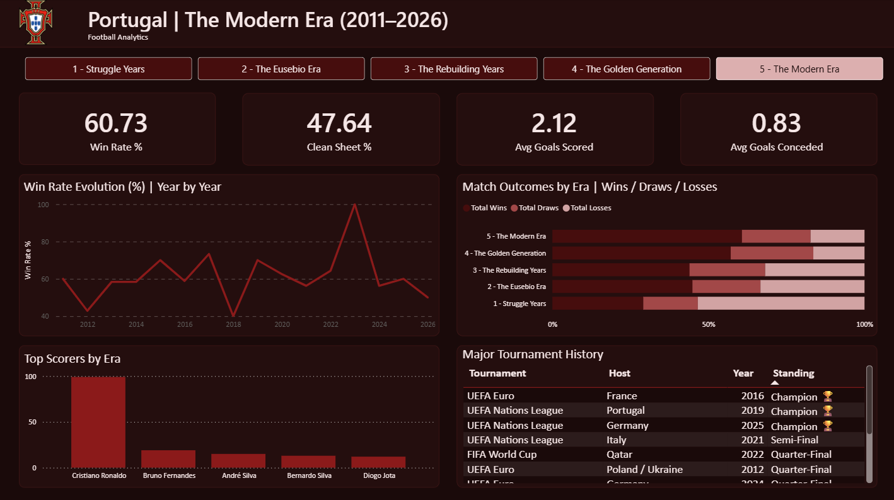

# Football Analytics - Portugal 1921–2026

A SQL and Power BI analysis of Portugal's international football history across 150 years and five distinct eras - from the first recorded match in 1921 to the present day. Built as a portfolio project to practice the full PostgreSQL → Power BI workflow.

---

## Dashboard Preview

> **Screenshot - Overall View (no era selected)**



> **Screenshot - Era selected: The Golden Generation (1994–2010)**



> **Screenshot - Era selected: The Modern Era (2011–2026)**




---

## Central Question

**How did Portugal evolve in international football from 1921 to today?**

The analysis breaks Portugal's full history into five eras - defined empirically from rolling 5-year win rate and defensive trends - and compares them across win rate, goals, tournament performance, scoring patterns, and sequence-based metrics.

---

## The Five Eras

Eras were not defined by assumption. A rolling 5-year win rate analysis (script `04_analysis_eras.sql`, query C0) identified structural breakpoints in Portugal's performance, which anchored every era boundary.

| # | Era | Period | Win Rate | Goals Conceded/Game |
|---|-----|--------|----------|----------------------|
| 1 | Struggle Years | 1921–1960 | 29.13% | 2.24 |
| 2 | The Eusébio Era | 1961–1974 | 44.87% | 1.15 |
| 3 | The Rebuilding Years | 1975–1993 | 43.94% | 1.13 |
| 4 | The Golden Generation | 1994–2010 | 57.14% | 0.78 |
| 5 | The Modern Era | 2011–2026 | 60.73% | 0.83 |

---

## Dashboard

Built in Power BI Desktop, connected directly to PostgreSQL (Import mode). Single-page dashboard with an era slicer that filters all visuals simultaneously.

### Slicer
Five era tiles across the top of the dashboard. Selecting an era filters every visual on the page - KPI cards, charts, scorers, and tournament history all update dynamically. When no era is selected, the dashboard shows the all-time overall view.

### KPI Cards
Four cards displayed in a row below the slicer:

- **Win Rate %** - percentage of matches won in the selected era
- **Clean Sheet %** - percentage of matches where Portugal conceded zero goals
- **Avg Goals Scored** - average goals scored per match
- **Avg Goals Conceded** - average goals conceded per match

### Win Rate Evolution (%) | Year by Year
Line chart showing Portugal's win rate year by year from 1921 to 2026. Best viewed with an era selected - without a filter the full 100-year range produces natural variance. The upward trend across eras is the clearest visual confirmation of Portugal's growth as a footballing nation.

### Match Outcomes by Era | Wins / Draws / Losses
Stacked bar chart showing the proportion of wins, draws, and losses for each era. Allows immediate visual comparison of how Portugal's results profile changed across generations. Era 4 and Era 5 are visually dominant - the win segments are significantly larger than any earlier era.

### Top Scorers by Era
Bar chart showing Portugal's top goalscorers filtered by the selected era. Updates with the slicer - Eusébio leads Era 2, Pauleta leads Era 4, CR7 dominates Era 5 with 99 goals (nearly 5x the next highest scorer in that era).

> **Note on Eusébio:** his tally in this dataset is 26 goals. The official FPF record is 41. The discrepancy is due to incomplete goalscorer coverage for matches before ~1968 in the source data. Team-level metrics are unaffected.

### Major Tournament History
Table showing every World Cup, UEFA Euro, and UEFA Nations League Portugal participated in, ordered by best standing. Includes tournament, host country, year, and final result. Reacts to the era slicer.

> **Note:** The source dataset contains match-level data only - it does not include tournament stages or final standings. This table was built manually as a DAX `DATATABLE` in Power BI, using the tournament results derived from the SQL analysis and cross-referenced with official records.

---

## Key Findings

- Portugal's win rate more than doubled from Era 1 (29.13%) to Era 5 (60.73%).
- The sharpest single improvement was defensive: goals conceded per game dropped from 2.24 to 0.78 between Era 1 and Era 4.
- Era 1 (1921–1960) failed to qualify for any of the 6 World Cups held during that period.
- The 1966 World Cup remains Portugal's best campaign by win rate: 83.33%, finishing 3rd.
- Clean sheet rate grew from 16.50% (Era 1) to a peak of 49.74% (Era 4) - nearly 1 in 2 matches.
- Era 4 holds Portugal's longest unbeaten run in history: 19 consecutive games without defeat.
- Era 5 recorded the most comeback wins (12) - more than the previous four eras combined (9).
- Portugal has won 2 UEFA Nations League titles (2019, 2025) - the only nation to win it more than once.
- Cristiano Ronaldo scored 99 goals in Era 5 alone - almost 5x the next highest scorer in that era.

### So - which era is the golden generation?

The data splits almost perfectly:

| | Era 4 - Golden Generation | Era 5 - Modern Era |
|---|---|---|
| **Wins on** | Goals conceded/game (0.78) | Win rate (60.73%) |
| | Clean sheet rate (49.74%) | Comeback wins (12) |
| | Longest unbeaten run (19) | Longest winning streak (11) |

**Era 4 is Portugal's most defensively dominant generation. Era 5 is its highest-achieving and most attacking generation.** The data does not produce a single winner - which is itself the most honest and interesting finding.

If forced to choose, **Era 5 - The Modern Era - edges it**. The reasoning is simple: it is the only era still ongoing, which means the numbers can only improve. It is also the era that produced Portugal's three major trophies - UEFA Euro 2016, UEFA Nations League 2019, and UEFA Nations League 2025 - making it the most decorated generation in the country's entire football history. No other era won anything.

---

## Era Rankings

A structured verdict across all five eras based on the full set of metrics analysed.

| Rank | Era | Why |
|------|-----|-----|
| 🥇 1st | **5 - The Modern Era (2011–2026)** | Highest win rate (60.73%), most comeback wins, longest winning streak, and 3 major trophies. Still ongoing - the ceiling has not been reached. |
| 🥈 2nd | **4 - The Golden Generation (1994–2010)** | Best defensive era in history (0.78 goals conceded/game), highest clean sheet rate (49.74%), longest unbeaten run (19 games), perfect shootout record (2/2). Narrowly loses to Era 5 only on trophies. |
| 🥉 3rd | **2 - The Eusébio Era (1961–1974)** | The first transformation. Win rate jumped from 29% to 45% in a single generation. Portugal's only World Cup medal (3rd place, 1966) came here. Small squad depth and short era length limit the ranking. |
| 4th | **3 - The Rebuilding Years (1975–1993)** | Maintained the defensive gains of Era 2 but never broke through to elite consistency. Only 2 major tournament appearances in 19 years. A necessary transition era, not a defining one. |
| 5th | **1 - The Struggle Years (1921–1960)** | 29% win rate, 2.24 goals conceded per game, zero World Cup qualifications in 39 years. The foundation from which everything else was built - not a failure, just the starting point. |

---

## SQL Scripts

All analysis was performed in PostgreSQL 16. Five scripts, executed in order.

### `1_setup.sql`
Creates all four tables and imports the raw CSV files directly from disk using `COPY`. Handles the date format inconsistency in `shootouts.csv` (DD/MM/YYYY vs YYYY-MM-DD in all other tables) by importing the date column as TEXT for later conversion.

**Tables created:** `results`, `goalscorers`, `shootouts`, `former_names`

---

### `2_cleaning.sql` - Block A
Full data quality audit across all four tables before any analysis.

| Check | Finding |
|-------|---------|
| Null values | None in critical columns across all tables |
| Duplicates in results | 1 duplicate found (Tahiti vs New Caledonia, 1974) - non-Portugal, left as-is |
| Impossible scores | 9 matches with 20+ goal margins - legitimate historical outliers, no action |
| String 'NA' in goalscorers | 256 rows in `minute`, 48 rows in `scorer` - `minute` converted to NULL, `scorer` left as-is (non-Portugal matches) |
| shootouts date format | Confirmed DD/MM/YYYY - converted to DATE type via `TO_DATE()` |
| first_shooter nulls | 429 NULLs - expected, missing historical data, no action |
| Portugal first match | Confirmed: 1921-12-18 (Spain 3–1 Portugal, Friendly, Madrid) |

---

### `3_exploration.sql` - Block B
Initial profiling of the dataset before defining eras or writing analysis queries.

Key queries:
- **B1** - Total matches: 693 (367 home, 326 away)
- **B2** - Matches per decade: volume grew from ~20/decade (1920s) to 127–128/decade (2000s–2010s)
- **B3** - Tournament distribution: 287 friendlies, 406 competitive matches
- **B4** - All-time record: 347W 159D 187L - goals scored 1223, conceded 776
- **B5** - Win rate per decade: confirmed the upward trend and the 1980s regression
- **B6** - Top opponents: Spain (42 matches, 19.05% WR), England toughest (13.04% WR), Luxembourg easiest (90.48% WR)
- **B7** - All-time top scorers: CR7 (121), Eusébio (26*), Pauleta (25)
- **B8** - Shootout record: 5W 3L from 8 total (62.50%)

---

### `4_analysis_eras.sql` - Block C
The core analysis script. Starts with a rolling 5-year breakpoint analysis (C0) that empirically justifies every era boundary, followed by 13 queries across five thematic blocks.

**C0** - Rolling 5-year win rate and goals conceded per game (1921–2026). Identifies the structural breakpoints used to define the five eras.

**Era overview (C1–C3)**
- Core record per era: matches, wins, draws, losses, win rate, goals scored/conceded
- Competitive matches only (excluding friendlies)
- Home vs away breakdown removed from scope - home_team field in dataset reflects designated side, not physical location

**Tournament performance (C4–C6)**
- World Cup record per era: 8 appearances total, best campaign 1966 (83.33% WR)
- UEFA Euro record per era: 9 appearances total, best campaign Euro 2000 (80.00% WR)
- Best and worst individual campaigns

**Scoring patterns (C7–C9)**
- Top scorers per era
- First half vs second half goals - Portugal consistently scores more in the second half across all eras
- Penalty goals per era - Era 5 has 24 penalty goals, nearly 3x Era 4

**Head-to-head and margins (C10–C12)**
- Biggest wins per era: Era 5 peak is 9–0 vs Luxembourg (2023)
- Biggest defeats per era: Era 1 worst is 0–10 vs England (1947)

**C13 - Era Scorecard**
Summary query combining all key metrics side by side per era. The query that directly answers the central question.

---

### `5_analysis_advanced.sql` - Block D
Sequence and defensive metrics. Four queries.

| Query | Finding |
|-------|---------|
| D1 - Clean Sheets | Peaked at 49.74% in Era 4 - nearly 1 in 2 matches |
| D2 - Comeback Wins | Era 5: 12 comebacks - more than Eras 1–4 combined |
| D3 - Winning Streaks | Era 5: 11 consecutive wins (Era 2: 9) |
| D4 - Unbeaten Runs | Era 4: 19 games - longest in history |

---

## Dataset

Source: [International Football Results 1872–2026](https://www.kaggle.com/datasets/martj42/international-football-results-from-1872-to-2017) (Kaggle, martj42)

| Table | Rows | Notes |
|-------|------|-------|
| `results` | 49,281 | Main match data - YYYY-MM-DD dates |
| `goalscorers` | 47,601 | Scorer, minute, own goal, penalty flags |
| `shootouts` | 675 | Date format normalised from DD/MM/YYYY |
| `former_names` | 36 | Historical country name lookup |

### Data Limitations

- `rankings.csv` (FIFA rankings) not included in this dataset version - ranking analysis removed from scope.
- Eusébio's goal tally in the dataset is 26; the official FPF record is 41. Discrepancy is due to incomplete goalscorer coverage for matches before ~1968. Team-level metrics are unaffected.
- Home/away analysis excluded - `home_team` reflects the dataset's designated side, not the physical host nation.
- 1 duplicate match in results (Tahiti vs New Caledonia, 1974) - non-Portugal, left as-is.

---

## Tech Stack

- **PostgreSQL 16** - all data cleaning, transformation, and analysis
- **Power BI Desktop** - dashboard connected via Import mode
- **pgAdmin 4** - query editor and database management

---

## Project Structure

```
Football/
  background_themes/            ← Dashboard theme + Background
	background.png
	football_theme.json
  data/                         ← raw CSVs, never modified
    results.csv
    goalscorers.csv
    shootouts.csv
    former_names.csv
  sql/
    1_setup.sql                 ← create tables + import CSVs
    2_cleaning.sql              ← data quality audit and fixes
    3_exploration.sql           ← initial exploration and profiling
    4_analysis_eras.sql         ← era breakdown, scorecard, C0–C13
    5_analysis_advanced.sql     ← streaks, comebacks, clean sheets
  powerbi/
    PT_Football_Dashboard.pbix  ← Power BI dashboard file
  README.md
```

---

*João Felicíssimo · 2026 · PostgreSQL + Power BI*
